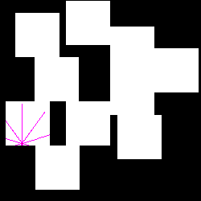

# Simplified Autonomous Robot Exploration

This project attempts to develop an efficient exploration strategy for a robot placed in an unknown environment using reinforcement learning techniques. The Proximal Policy Optimization (PPO) algorithm implemented in the Stable Baselines3 library is used to train an exploration policy. A custom environment in the OpenAI Gym framework that simulated the robot's movement and sensing capabilities. The environment was designed to simulate an unknown 2D space that the robot needed to explore to maximize its reward.

## Installation
To setup conda environment, run the following commands

`conda create --name me5406-ARE --file requirements.txt`

`conda activate me5406-ARE`

`pip install --user jupyter stable-baselines3[extra] pyastar2d tensorboard`

## Run
The training and running code can be found in Runner.ipynb

## Files

There are 3 main python files that are imported in the Runner.ipynb notebook:

utils.py - contains various useful functions in the project

World.py - class definition for creating the actual world with the robot

AREgym.py - class definition for the gym environment

## Main Python Libraries
1. numpy
2. cv2
3. pyastar2d
4. stable_baselines3
5. tensorboard
6. imageio
